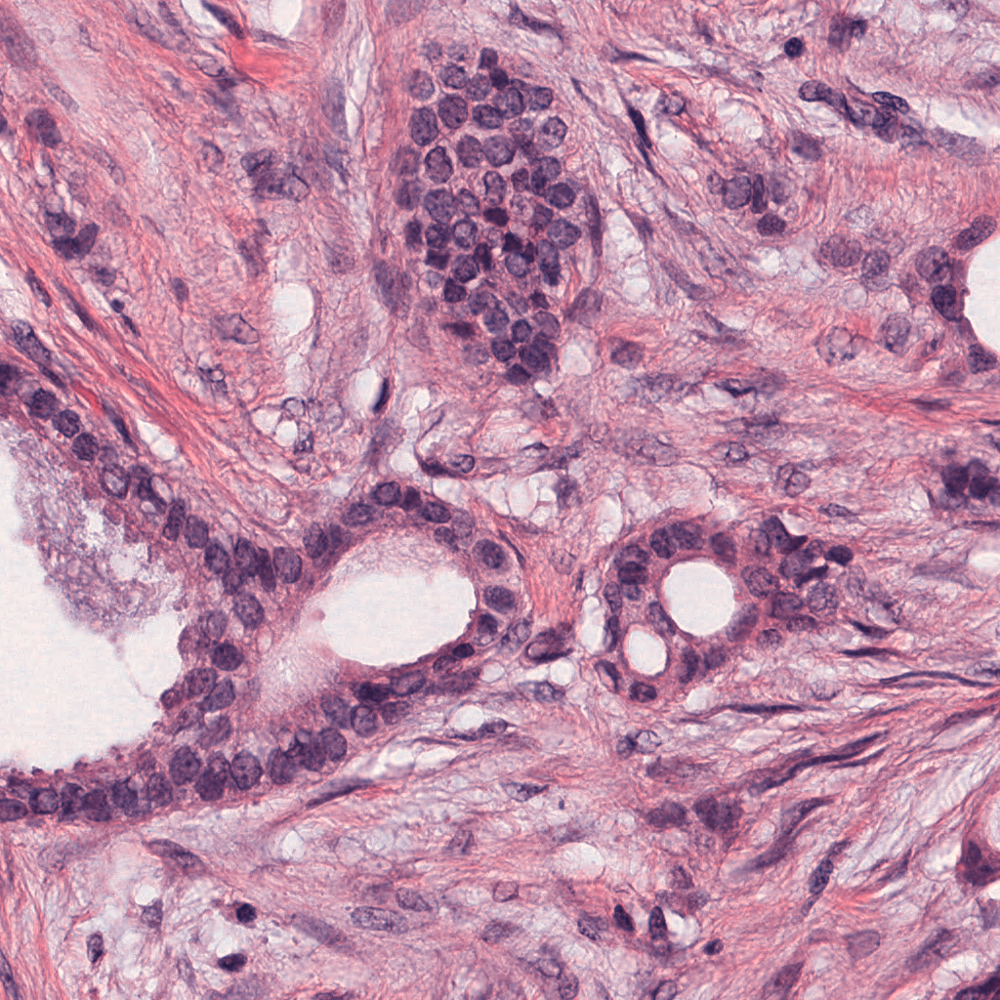

# Staining Unmixing and Normalization in Python

NOTE: Originally published at the Assessment of Mitosis Detection Algorithms 2013 challenge website (http://http://amida13.isi.uu.nl).

One of the major difficulties in histopathology image analysis is apperance variability. 
For example, when performing mitosis detection, many false positives can arise when the histopathology slide is overstained. 
This Python code, adapted from the original MATLAB implementation, performs staining unmixing (separation of the hematoxylin and eosing stains) and apperance normalization. 
It is based on the method described in [1]. Some examples of staining normalization can be seen in the figure below.

## Original Images

## Normalized Images

[1] A method for normalizing histology slides for quantitative analysis, M Macenko, M Niethammer, JS Marron, D Borland, JT Woosley, G Xiaojun, C Schmitt, NE Thomas, IEEE ISBI, 2009. dx.doi.org/10.1109/ISBI.2009.5193250

